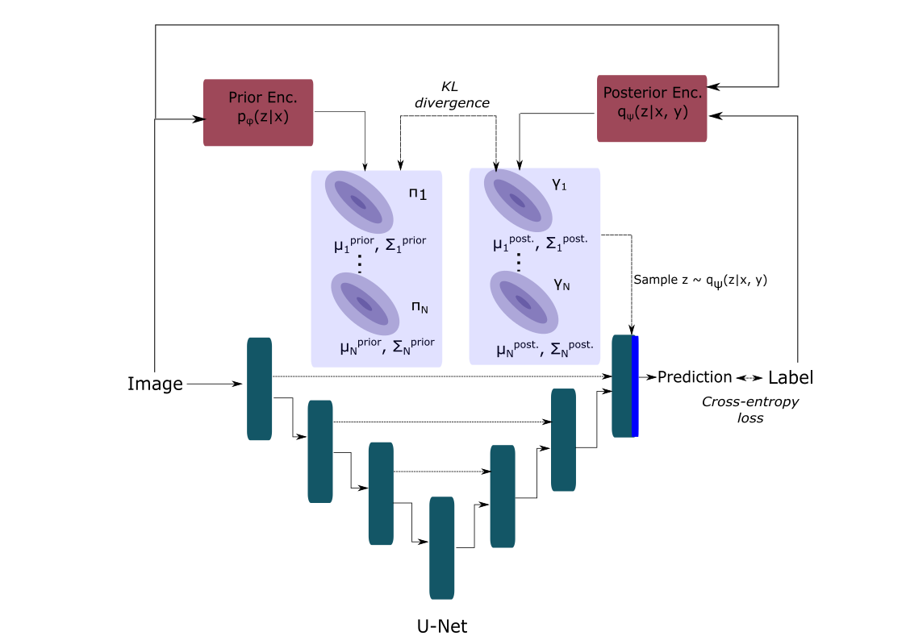
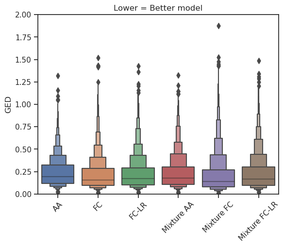

### Generalized Probabilistic U-Net

We propose three extensions to the [Probabilistic U-Net](https://proceedings.neurips.cc/paper/2018/hash/473447ac58e1cd7e96172575f48dca3b-Abstract.html) by using more expressive forms of the Gaussian distribution as choices for the latent space distributions. In addition to the default choice for the latent space distribution (axis-aligned Gaussian), the Generalized Probabilistic U-Net supports the following:
* Full-covariance Gaussian
* Full-covariance Gaussian with a low-rank parameterization
* Mixture of Gaussians

During training, the model learns prior and posterior distribution parameters for the latent space distributions. In the most general case, the prior and posterior distributions are modelled as a mixture of N Gaussians. By setting N and restricting the covariance matrix to be diagonal, we recover the original Probabilistic U-Net. During inference, the posterior encoder is discarded and different plausible outputs can be computed by sampling from the prior distribution and combining this sample with the last U-Net layer.

We compare the different choices for the latent space distributions with respect to the GED metric on the LIDC-IDRI dataset:

 ### Usage:
 Follow these steps to use this model in your project:
 
 * Clone this repository into a local folder 
 
 * Install the model in your python environment
   `python setup.py install`
 
 * Import the model into your script
   `from probabilistic_unet.model import ProbabilisticUnet`

The model is tested with Pytorch 1.7.0 and Python 3.7.3.

 If you have any questions, please open a pull-request or issue and I will get back to you
 
### Acknowledgements

Our implementation is based on:
* [Probabilistic U-Net, LIDC data](https://github.com/stefanknegt/Probabilistic-Unet-Pytorch)
* [Normalizing Flows (untested)](https://github.com/raghavian/cFlow)
